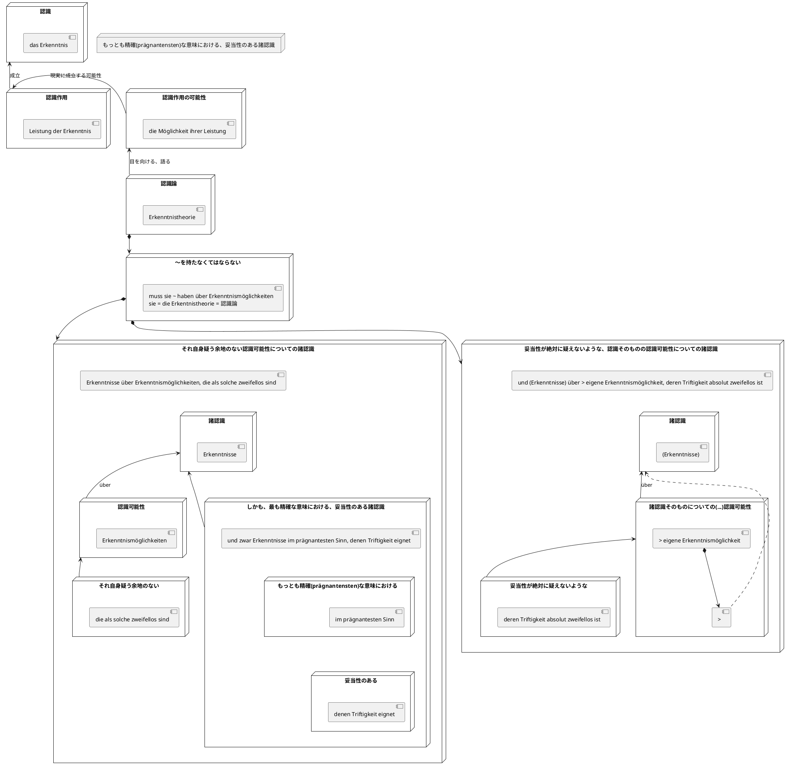

[フッサール](http://d.hatena.ne.jp/keyword/%A5%D5%A5%C3%A5%B5%A1%BC%A5%EB)、[長谷川宏](http://d.hatena.ne.jp/keyword/%C4%B9%C3%AB%C0%EE%B9%A8) 訳『[現象学](http://d.hatena.ne.jp/keyword/%B8%BD%BE%DD%B3%D8)の理念』p.5

「いずれにせよ、認識論が認識の可能性に目をむけようとすれば、(...)認識されていなければならない。」の範囲を、原文を比較しながら整理した。

認識論が「認識の可能性」という問題をその範囲で扱う場合に、認識論が持つ(haben)べき諸認識(Erkenntnisse)について。

「それ自身として疑う余地の無い(zweifellos)認識可能性(Erkenntnismöglichkeiten)」というものについての諸認識

しかもこの諸認識は、最も精確な意味における(im prägnantesten Sinn)ものであり、その妥当性は、それら諸認識自らの内にある(, denen Triftigkeit eignet)ようなもの

妥当性が決して疑い得ない、諸認識そのものの認識可能性(> eigene Erkenntnismöglichkeit)についての諸認識

認識論が認識の可能性に目を向けようとする際の、認識論が持つべき認識

  ソース

参照した資料

[Die Idee der Phänomenologie: Text nach "Husserliana", Band II (Philosophische Bibliothek 392) (German Edition)](https://www.amazon.co.jp/exec/obidos/ASIN/B01CPB8AV2/hatena-blog-22/)

作者:[Husserl, Edmund](http://d.hatena.ne.jp/keyword/Husserl%2C%20Edmund)Felix Meiner Verlag[Amazon](https://www.amazon.co.jp/exec/obidos/ASIN/B01CPB8AV2/hatena-blog-22/)
[現象学の理念](https://www.amazon.co.jp/exec/obidos/ASIN/4878932775/hatena-blog-22/)

作者:[E. フッサール](http://d.hatena.ne.jp/keyword/E.%20%A5%D5%A5%C3%A5%B5%A1%BC%A5%EB)作品社[Amazon](https://www.amazon.co.jp/exec/obidos/ASIN/4878932775/hatena-blog-22/)
[Die Idee der Phänomenologie | Husserl Edmund](https://ophen.org/pub-108118)
